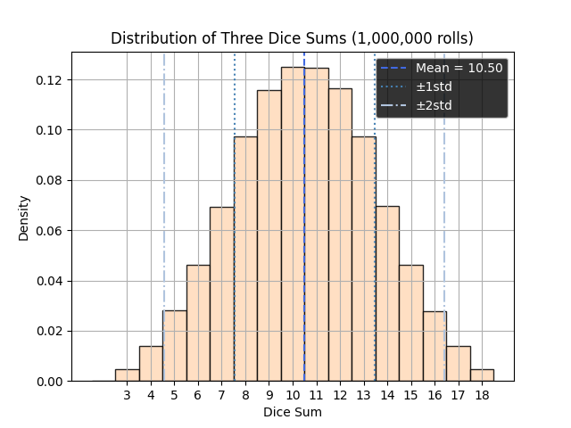

# Dice Roll Probability Analysis

## Project Goal

The goal of this project is to test whether Python's random number generation using `random.randint()` can simulate a distribution that approximates a normal distribution and follows the empirical 68–95–99.7 rule.

The simulation rolls three dice a large number of times and analyzes the distribution of the sums obtained.

---

## Features

- Simulates any number of three-dice rolls
- Computes:
  - frequency distribution
  - probabilities of each sum
  - mean
  - standard deviation
  - probabilities within 1, 2, and 3 standard deviations
- Visualizes the distribution using Matplotlib
- Measures execution time

---

## Technologies Used

- Python
- Pandas
- Matplotlib

---

## Statistical Background

According to the Central Limit Theorem, the sum of independent random variables tends to approximate a normal distribution.

This project investigates whether repeated calls to `random.randint()` produce a bell-shaped distribution and whether the generated data approximately respects the:

- 68% within 1 standard deviation
- 95% within 2 standard deviations
- 99.7% within 3 standard deviations

empirical rule commonly associated with normal distributions.

Because dice sums are discrete values and not perfectly Gaussian, the results are approximate rather than exact.

---

## Example Output

```text
Average: 10.50
Standard Deviation: 2.96
Probability within one standard deviation: 67.80%
Probability within two standard deviations: 96.20%
Probability within three standard deviations: 100.00%
```

---

## Distribution Graph



---

## How to Run

```bash
pip install -r requirements.txt
python dice_simulation.py
```

---

